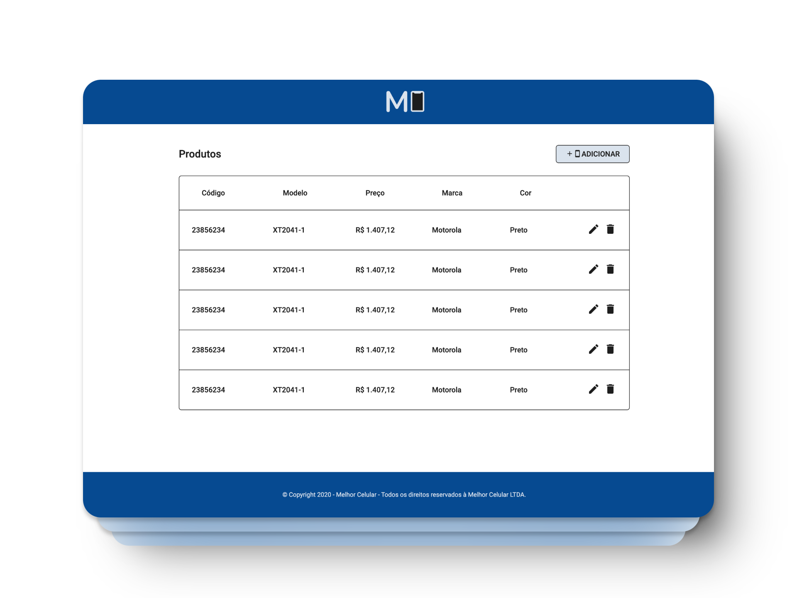

# MelhorCom - Frontend

## Proposta

Uma empresa está prestes a lançar um novo aplicativo para venda de celulares e deseja um website para gerenciar o cadastro de novos celulares. A aplicação será desenvolvida em ReactJS.

### Funcionais
- Cadastro de novos celulares com os seguintes campos:
  - Modelo, Preço, Marca, Cor, Código, Data de início das vendas, Data de fim das vendas
- Edição, exclusão e listagem de celulares cadastrados.
- Validação de entradas de formulário, com mensagens de erro apropriadas.
- Responsividade para adaptação a diferentes dispositivos (opcional, mas um adicional).

🔗 **Experimente agora mesmo:** [shopcell.vercel.app](https://shopcell.vercel.app/)

## Tecnologias

<p>
  
  
  
  
  
  
  </a>
</p>



## Bibliotecas

- **React**: Biblioteca JavaScript para construção de interfaces de usuário interativas.
- **Next.js**: Framework React para criação de aplicações web com funcionalidades como renderização do lado do servidor e geração de páginas estáticas.
- **Material UI**: Biblioteca de componentes de interface de usuário com foco em design responsivo e interativo.
- **React Router DOM**: Gerencia as rotas da aplicação, permitindo a navegação entre diferentes páginas.
- **Axios**: Biblioteca para realizar requisições HTTP para comunicação com APIs externas.
- **React Hook Form**: Biblioteca para gestão de formulários com validação de dados.
- **Zod**: Biblioteca para validação de esquemas de dados, utilizada para garantir a consistência nas entradas do usuário.


## Funcionalidades Implementadas

### Cadastro de Celulares
- A página de cadastro permite inserir detalhes sobre o celular (modelo, preço, marca, cor, etc).
- As entradas são validadas em tempo real, com mensagens de erro caso algo esteja incorreto.
  
### Listagem de Celulares
- Exibição de uma tabela com todos os celulares cadastrados.
- Cada item da tabela possui botões para editar ou excluir o celular.
  
### Responsividade
- A interface foi projetada para ser responsiva e se adaptar a diferentes dispositivos, incluindo desktops e dispositivos móveis.

## Ações Futuras
- Adicionar integração com uma API para persistência de dados.
- Melhorias na usabilidade e acessibilidade.

## Como usar o projeto

1. Clone o repositório:
    ```bash
    git clone https://github.com/anaclaraaraujo/melhorcom-frontend.git
    cd melhorcom-frontend
    ```
    
2. Instale as dependências:
    ```bash
    npm install
    ```
    
3. Inicie o servidor de desenvolvimento:
    ```bash
    npm run dev
    ```
    
4. Abra no navegador:
    - Acesse [http://localhost:5173/](http://localhost:5173/)

## Licença 
[](https://github.com/anaclaraaraujo/melhorcom-frontend/blob/main/LICENSE)
